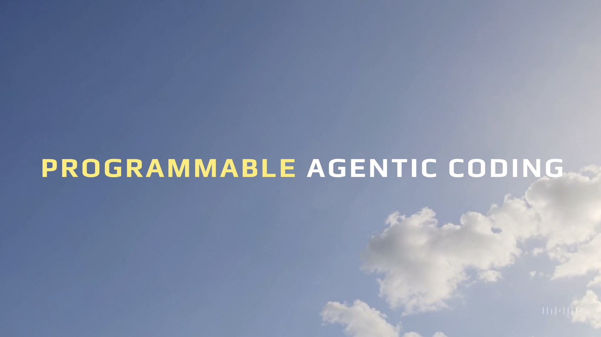

# Claude Code is Programmable

This repository demonstrates how to use Claude Code programmatically, showcasing examples in different programming languages. Watch [this video](https://youtu.be/2TIXl2rlA6Q) to understand why this is so important for next generation engineering. Check out the [voice to Claude Code](https://youtu.be/LvkZuY7rJOM) video to see how to use the `voice_to_claude_code.py` script.




## Quick Start

First off - run these right away to understand how important this is:

```bash
# Claude Code example (with only Write and Edit tools allowed)
claude -p "make a hello.js script that prints hello" --allowedTools "Write" "Edit"

# Aider equivalent example
aider --message "make a hello.js script that prints hello" hello.js
```

Here's the big trick - with Claude Code, you can call ANY TOOL IN ANY ORDER IN NATURAL LANGUAGE.

Check out the other examples in the repo to understand how to scale your impact with this feature.

Watch [this video](https://youtu.be/2TIXl2rlA6Q) to internalize how important this is for next generation engineering. View the brief anthropic documentation [here](https://docs.anthropic.com/en/docs/agents-and-tools/claude-code/tutorials#use-claude-as-a-unix-style-utility) and a more comprehensive write up on [agentic coding here](https://www.anthropic.com/engineering/claude-code-best-practices). The Claude Code team is doing incredible work.

You can also use [Aider](https://aider.chat/) as a programmable ai coding tool to do similar things although it's strictly limited to AI Coding (which is still incredibly useful). Check out the documentation [here](https://aider.chat/docs/scripting.html).

## Setup

### Configuration Files

1. **MCP (Multi-call Protocol) Configuration**
   - Copy the sample configuration file to create your own:
     ```bash
     cp .mcp.sample.json .mcp.json
     ```
   - Edit `.mcp.json` to add your Notion API key in the `OPENAPI_MCP_HEADERS` section:
     ```json
     {
       "mcpServers": {
         "notionApi": {
           "command": "npx",
           "args": ["-y", "@notionhq/notion-mcp-server"],
           "env": {
             "OPENAPI_MCP_HEADERS": "{\"Authorization\": \"Bearer YOUR_NOTION_API_KEY\", \"Notion-Version\": \"2022-06-28\" }"
           }
         }
       }
     }
     ```

2. **Environment Variables**
   - Copy the sample environment file:
     ```bash
     cp .env.sample .env
     ```
   - Add the following API keys to your `.env` file:
     ```
     NOTION_INTERNAL_INTEGRATION_SECRET=your_notion_integration_secret
     ANTHROPIC_API_KEY=your_anthropic_api_key
     OPENAI_API_KEY=your_openai_api_key
     ```
   - Note: The voice_to_claude_code.py script specifically requires both ANTHROPIC_API_KEY and OPENAI_API_KEY to be set.
   - The anthropic_search.py script requires ANTHROPIC_API_KEY to be set.

## File Descriptions

### Shell Scripts
- `claude_code_is_programmable_1.sh`: Simple shell script that uses Claude Code's CLI to generate a basic "hello.js" script with limited allowed tools.
  ```bash
  sh claude_code_is_programmable_1.sh
  ```
- `aider_is_programmable_1.sh`: Similar script using Aider to create a "hello.js" file.
  ```bash
  sh aider_is_programmable_1.sh
  ```
- `reset.sh`: Utility script to clean up branches and directories created by the demo scripts.
  ```bash
  sh reset.sh
  ```

### Python Files
- `claude_code_is_programmable_2.py`: Python script that executes Claude Code to create a TypeScript CLI todo app, with permissions for Edit, Replace, Bash, and Create tools.
  ```bash
  uv run claude_code_is_programmable_2.py
  ```
- `claude_code_is_programmable_3.py`: Advanced Python script integrating Claude Code with Notion API for todo management, including rich console output and streaming results. Requires a Notion page name as an argument.
  ```bash
  uv run claude_code_is_programmable_3.py "My Notion Page"
  ```
- `aider_is_programmable_2.py`: Python script that uses Aider to create a TypeScript todo application with git operations.
  ```bash
  uv run aider_is_programmable_2.py
  ```
- `anthropic_search.py`: A self-contained Python script for searching the web using Anthropic's Claude AI with web search capabilities.
  ```bash
  ./anthropic_search.py "your search query"
  ```

### JavaScript Files
- `claude_code_is_programmable_2.js`: JavaScript version of the Claude Code script that creates a TypeScript todo app, with permissions for Edit, Replace, Bash, and Create tools.
  ```bash
  bun claude_code_is_programmable_2.js
  ```
- `aider_is_programmable_2.js`: JavaScript version of the Aider script for creating a TypeScript todo app with git operations.
  ```bash
  bun aider_is_programmable_2.js
  ```

### Voice to Claude Code
- `voice_to_claude_code.py`: A voice-enabled Claude Code assistant that allows you to interact with Claude Code using speech commands. Combines RealtimeSTT for speech recognition and OpenAI TTS for speech output.
  ```bash
  uv run voice_to_claude_code.py

  # With a specific conversation ID
  uv run voice_to_claude_code.py --id "my-chat-id"

  # With an initial prompt
  uv run voice_to_claude_code.py --prompt "create a hello world script"

  # With both ID and prompt
  uv run voice_to_claude_code.py --id "my-chat-id" --prompt "create a hello world script"
  ```

### Bonus Directory
- `starter_notion_agent.py`: A starter template for creating a Notion agent using the OpenAI Agent SDK.
  ```bash
  uv run bonus/starter_notion_agent.py
  ```
- `claude_code_inside_openai_agent_sdk_4_bonus.py`: An advanced implementation that integrates Claude Code within the OpenAI Agent SDK. Requires a Notion page name as an argument.
  ```bash
  uv run bonus/claude_code_inside_openai_agent_sdk_4_bonus.py "My Notion Page"
  ```

## Core Tools Available in Claude Code

- Task: Launch an agent to perform complex tasks
- Bash: Execute bash commands in a shell
- Batch: Run multiple tools in parallel
- Glob: Find files matching patterns
- Grep: Search file contents with regex
- LS: **List** directory contents
- Read: Read file contents
- Edit: Make targeted edits to files
- Write: Create or overwrite files
- NotebookRead/Edit: Work with Jupyter notebooks
- WebFetch: Get content from websites

## Claude Code response formats

```sh
claude -p 'hello, run git ls-files, how many files are in the current directory' --output-format text > test.txt
claude -p 'hello, run git ls-files, how many files are in the current directory' --output-format json > test.json
claude -p --continue 'hello, run git ls-files, how many files are in the current directory' --output-format stream-json > test.stream.json
```

## Anthropic Web Search Tool
> See the [anthropic_search.py](anthropic_search.py) file for more details.

A command-line utility for searching the web using Anthropic's Claude AI with their web search tool capability.

### Prerequisites

- Python 3.8+
- UV package manager (`pip install uv`)
- Anthropic API key

### Setup

Make the script executable:
```
chmod +x anthropic_search.py
```

### Usage

Basic search:
```
./anthropic_search.py "your search query"
```

With domain filtering (only include results from these domains):
```
./anthropic_search.py "javascript best practices" --domains "developer.mozilla.org,javascript.info"
```

Block specific domains:
```
./anthropic_search.py "climate change" --blocked "unreliablesource.com,fakenews.org"
```

With location context:
```
./anthropic_search.py "local restaurants" --location "US,California,San Francisco" --timezone "America/Los_Angeles"
```

Increase maximum searches:
```
./anthropic_search.py "complex research topic" --max-uses 5
```

Use a different Claude model:
```
./anthropic_search.py "your query" --model "claude-3-5-sonnet-latest"
```

### Output

The script produces:
1. The search query used
2. Claude's response with inline citations marked as [1], [2], etc.
3. A list of sources at the end, numbered to match the citations
4. Usage information showing how many web searches were performed

### Notes

- Web search is available on Claude 3.7 Sonnet, Claude 3.5 Sonnet, and Claude 3.5 Haiku
- Each search counts as one use, regardless of the number of results returned
- Searches cost $10 per 1,000 searches, plus standard token costs for search-generated content
- Domain filtering doesn't need https:// prefixes and automatically includes subdomains

Built with ❤️ by [IndyDevDan](https://www.youtube.com/@indydevdan) with [Claude Code](https://docs.anthropic.com/en/docs/agents-and-tools/claude-code/overview), and [Principled AI Coding](https://agenticengineer.com/principled-ai-coding)

